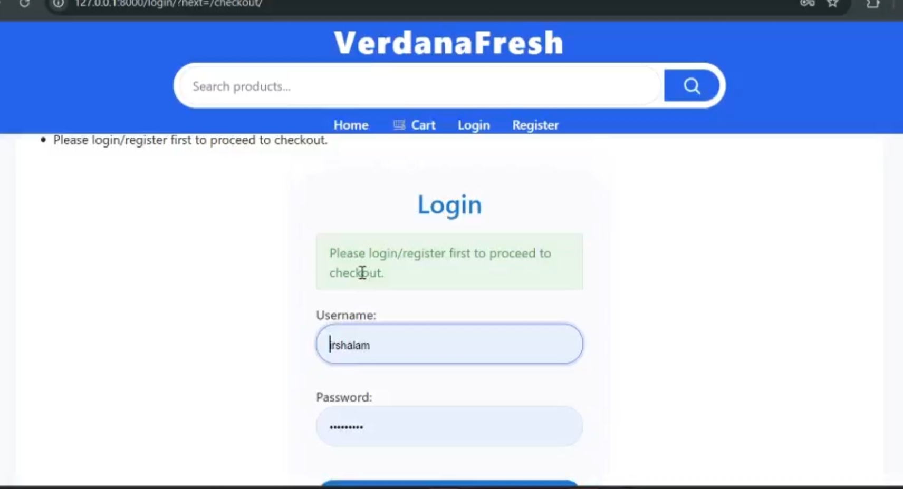
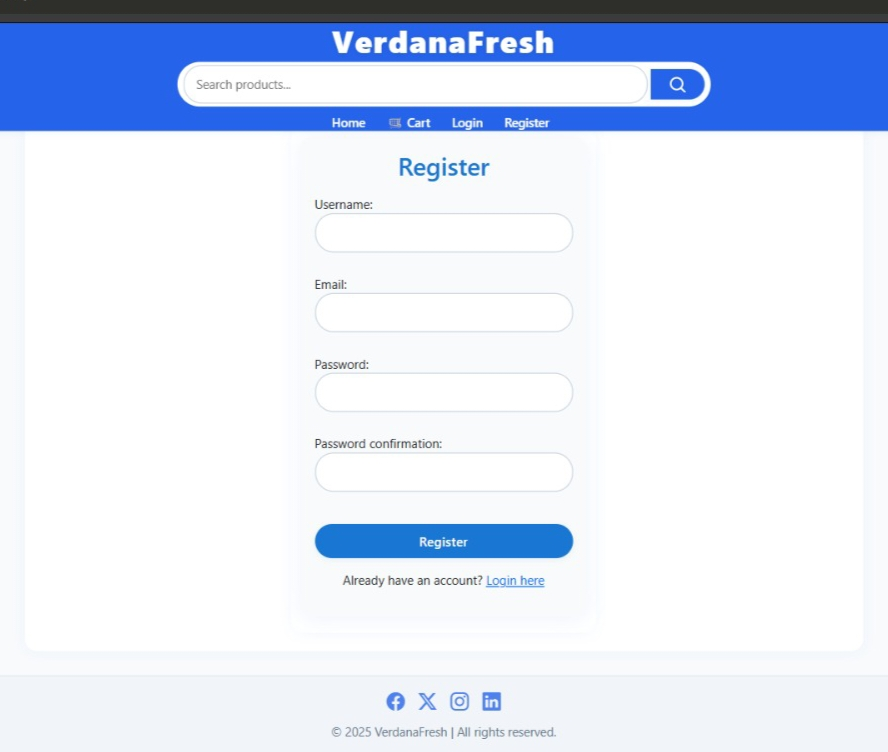
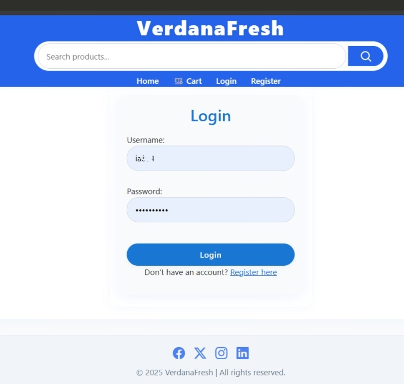
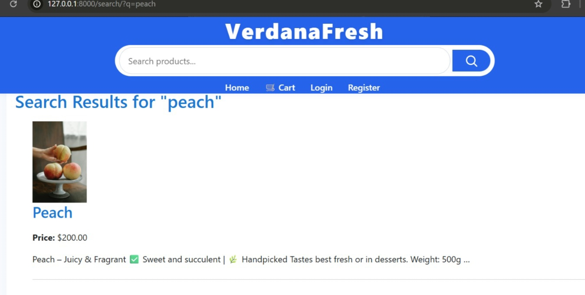
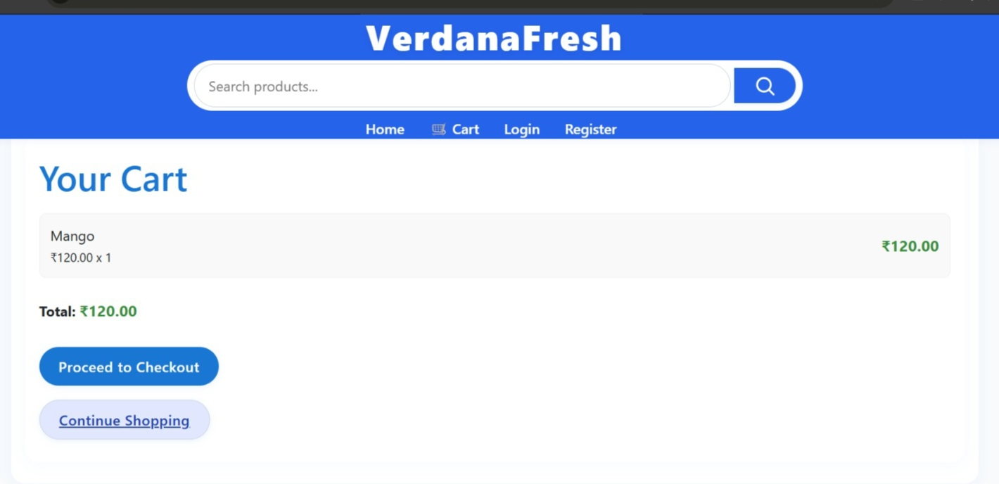
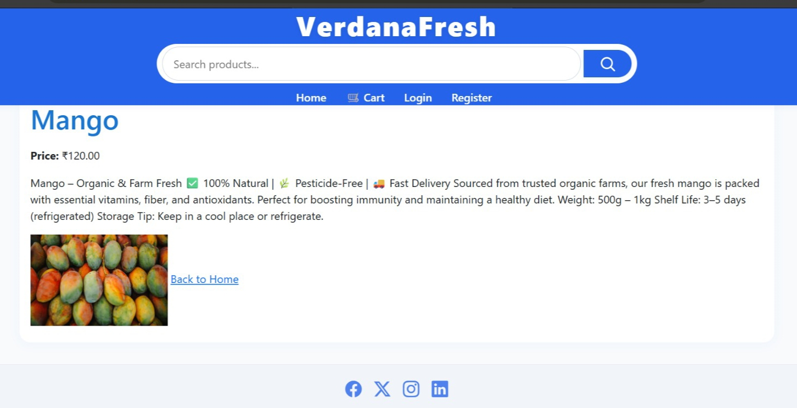
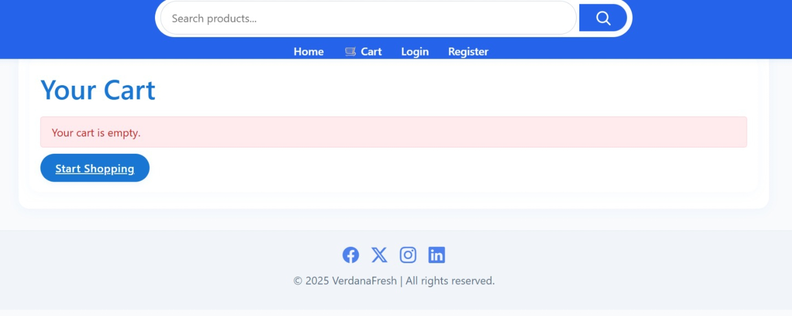
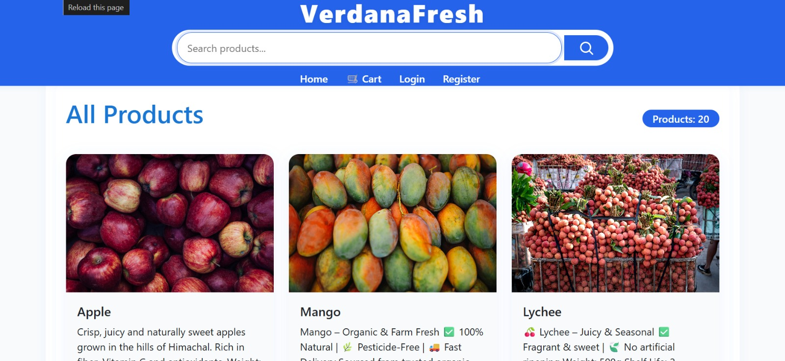

# Verdana Fresh 🌿 - Organic E-Commerce Web App

A fresh and clean e-commerce platform for ordering organic vegetables, fruits, and dairy products — free from chemicals, straight from nature.

---

## Features added

- **Authentication** — Register with email, Login & Logout
- **Product Listing** — Browse organic vegetables, fruits & dairy products
- **Add to Cart** — Add/remove items from cart
- **Checkout** — Place your order seamlessly
- **Order Tracking** — Track your order status
- **Pages** — Home, Cart, Login, Register, Track Order

> ⚠️ Payment gateway not integrated yet — coming soon!

---

## Product Categories

- 🥬 Fresh Vegetables
- 🍎 Fresh Fruits
- 🥛 Dairy Products

> All products are **100% organic** — no chemicals used in production.

---

## Tech Stack

**Frontend**
- HTML
- CSS

**Backend**
- Python
- Django
  
---

## 📸 Screenshots























---

## How to Run Locally

1. Clone the repository
   ```
   git clone https://github.com/irshad7a/e-commerce-webapp-.git
   ```
2. Install dependencies
   ```
   pip install -r requirements.txt
   ```
3. Run migrations
   ```
   python manage.py migrate
   ```
4. Start the server
   ```
   python manage.py runserver
   ```
5. Open browser and go to `http://127.0.0.1:8000`
---

## Developer

Made by [irshad7a](https://github.com/irshad7a)
